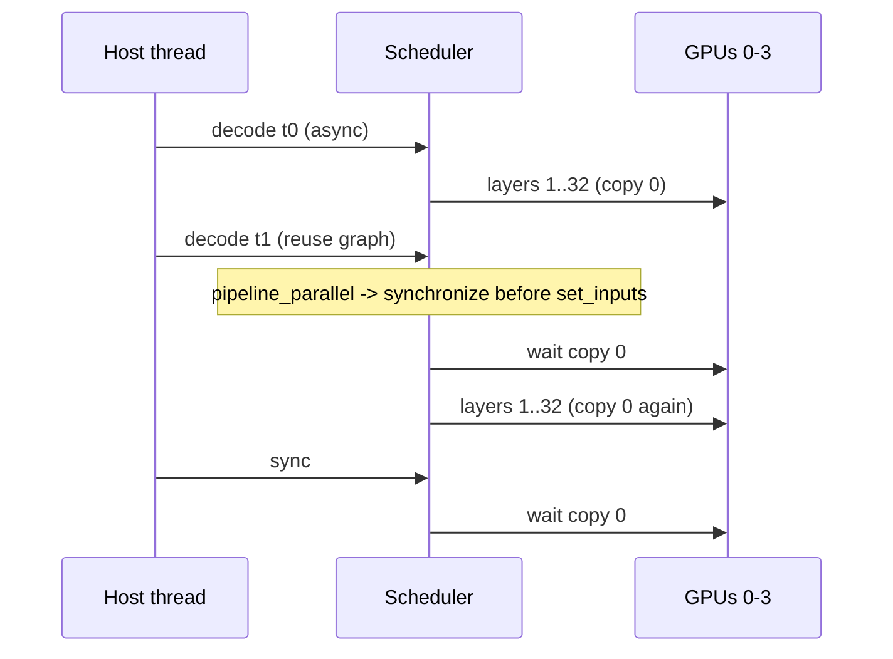
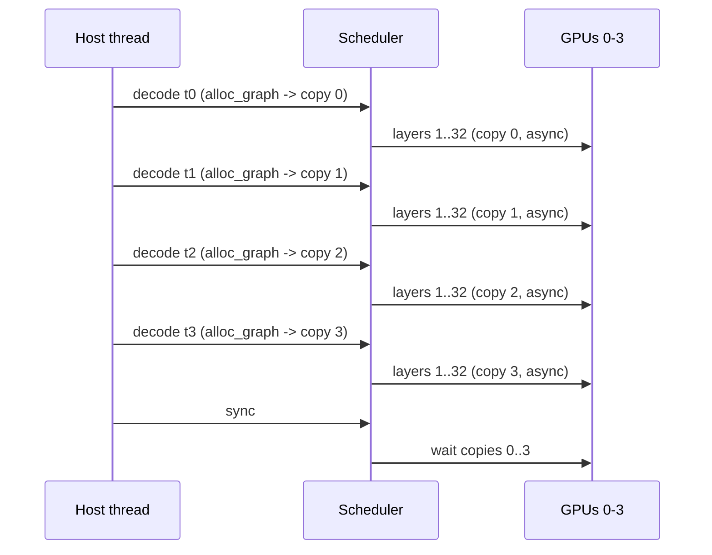

# Pipeline parallelism overlap: single-context chain decode (Theory B)

Status: complete. Executed on rig1, 2026-09-27.

Tracked by: issue #5 (Theory B). Mechanism and serial baseline: see
`pipeline-parallelism-analysis.md` and `pipeline-parallelism-baseline.md`. Parallel-context
result (Theory A): `pipeline-parallelism-overlap.md`.

---

## 1. What was measured

The goal: confirm whether a single `llama_context` can issue several `llama_decode` calls
back-to-back before one `llama_synchronize`, and whether the `n_copies = 4` + CUDA-events
mechanism then overlaps successive decode steps of that one request stream.

Method: a minimal driver (`llama-chain` in `examples/pipeline/`) loads a dense model
layer-split across the 4 GPUs, creates one context, and decodes greedily. Each outer step
issues M single-token decodes of the current token back-to-back, then one
`llama_synchronize`, then samples one token. A serial reference (decode -> sync per step)
runs first in the same process; greedy outputs are compared step-by-step. M in {2, 4, 8},
16 outer steps, 128 prompt tokens.

The draft tokens here are the degenerate "naive tree": the current token is repeated M
times. That is enough to exercise the back-to-back-decode primitive; a real speculative
tree or draft model would slot in the same way.

---

## 2. Model and configuration

- Model: `Qwen3.5-9B-Q4_K_M.gguf` (dense `qwen35`, 5.68 GB, 32 layers).
- Driver: `llama-chain -m ... -sm layer -ngl all -ts 1,1,1,1 -ctk f16 -ctv f16 -fa off
  -c 1024 --prompt-len 128 --chain M --repeats 16`.
- 33/33 layers on GPU, no CPU offload. `pipeline parallelism enabled`, `sched copies = 4`.
- Toggle: `LLAMA_GRAPH_REUSE_DISABLE=0` (default) vs `=1` (force graph re-allocation per
  decode, which rotates `cur_copy` / `next_copy`).

---

## 3. The graph-reuse caveat

By default llama.cpp reuses the same compute graph for every decode of the same shape. That
reuse fast path calls `ggml_backend_sched_synchronize` before writing new inputs when
`pipeline_parallel` is on (`process_ubatch` in `src/llama-context.cpp`). A synchronize
resets `next_copy` to 0, so the next decode reuses copy 0 and waits for the previous one:
the back-to-back decodes do not overlap.

`LLAMA_GRAPH_REUSE_DISABLE=1` routes every decode through
`ggml_backend_sched_alloc_graph`, which rotates `cur_copy` / `next_copy` and issues the
compute asynchronously on different copies, letting successive decodes overlap the layer
pipeline. The driver is run both ways to isolate this.

### Reuse path (default): implicit sync serialises

Each decode waits for the previous one: the `set_inputs` synchronise resets the copy
rotation, so `n_copies` never gets past copy 0.

### Reuse-disabled path: copy rotation overlaps

Each `alloc_graph` rotates `cur_copy`/`next_copy`, so successive decodes run on different
buffers and event slots; copy k+1 starts while copy k is still in flight.

---

## 4. Results

| M | reuse | serial wall (s) | chain wall (s) | speedup | samples match | per-GPU SM (avg) |
|---|---|---|---|---|---|---|
| 2 | 0 | 5.62 | 5.62 | 1.00x | 16/16 | 18.2 - 25.1% |
| 2 | 1 | 5.68 | 3.90 | 1.46x | 16/16 | 16.3 - 26.0% |
| 4 | 0 | 11.37 | 11.38 | 1.00x | 16/16 | 18.6 - 28.2% |
| 4 | 1 | 12.15 | 6.13 | 1.98x | 16/16 | 21.1 - 31.5% |
| 8 | 0 | 23.30 | 24.04 | 0.97x | 16/16 | 19.0 - 29.8% |
| 8 | 1 | 23.05 | 10.70 | 2.15x | 16/16 | 22.2 - 41.0% |

Serial and chain do the same number of decode ops per run (M x 16). The wall-time difference
is therefore pure overlap, not batching: the driver always decodes exactly one token per
`llama_decode`, so there is no per-ubatch batching effect.

Correctness: greedy samples match the serial reference at every outer step in every run
(`samples match = 16/16`). Back-to-back decodes before one sync do not corrupt the KV cache
or the sampled token.

---

## 5. Interpretation

- Default graph reuse (reuse=0): speedup is 0.97-1.00x - the reuse path's implicit sync
  serializes the M decodes, so there is no overlap and a small overhead.
- Graph reuse disabled (reuse=1): speedup rises with M - 1.46x (M=2) -> 1.98x (M=4) ->
  2.15x (M=8). This is the `n_copies` rotation actually overlapping successive decode steps
  of a single request stream.
- Per-GPU SM trends up with M under reuse=1; at M=8 the tail GPU (GPU3) averages 41.0%,
  above the ~35% serial plateau. The figure is diluted because dmon samples the whole
  process (serial phase first, then chain phase), so the throughput delta is the cleaner
  signal.

The gain here is on the raw decode throughput of the chain (overlapped decodes vs
decode+sync each). A real speculative decoder would spend the same overlap to verify M
draft tokens per sync; the primitive that makes that work - M decodes then one sync, with
graph reuse disabled - is what this confirms.

---

## 6. Conclusion

Theory B holds, with a caveat. A single context can issue M decodes back-to-back before one
sync, correctness is preserved, and the overlap fires - but only when graph reuse is
disabled (`LLAMA_GRAPH_REUSE_DISABLE=1`). With the default reuse path the decodes are
serialized by the pre-set_inputs synchronize, so the dormant `n_copies` mechanism is never
engaged. The driver lives in `examples/pipeline/chain.cpp` and the sweep harness in
`bench/run_chain.sh`.
