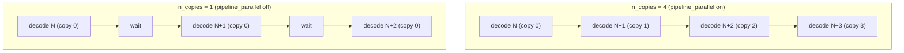

# Pipeline parallelism control: overlap vs batching (Theory D)

Status: complete. Executed on rig1, 2026-09-27.

Tracked by: issue #7 (Theory D). Mechanism and serial baseline: see
`pipeline-parallelism-analysis.md` and `pipeline-parallelism-baseline.md`. Theory A result
(parallel contexts): `pipeline-parallelism-overlap.md`. Theory B result (single-context
chain): `pipeline-parallelism-chain.md`.

---

## 1. What was measured

The goal: separate the two candidate sources of the throughput gain reported by #4, #5 and
#6 - genuine cross-graph pipeline overlap (the `n_copies` copy-rotation + CUDA-events
mechanism) versus simply having more work in flight (batching across independent streams).
The #2 baseline already showed the N=1 -> N=8 server rise is batching, so any new gain must
be pinned to overlap.

Method: a control that forces `pipeline_parallel` off, which makes the scheduler allocate
`n_copies = 1` instead of `n_copies = 4`. The same drivers and batch sizes are then run
under `n_copies = 1` and `n_copies = 4`; the delta isolates the copy-rotation overlap. Two
drivers are exercised because they stress different mechanisms:

- `llama-pipeline` (#4): K independent contexts, each with its own scheduler and CUDA
  stream. `overlap` issues K decodes then K syncs; `serial` decodes and syncs one context
  at a time.
- `llama-chain` (#5): one context, one scheduler. Each step issues M single-token decodes
  back-to-back then one sync; a serial reference decodes -> syncs per step.

---

## 2. The control toggle

`pipeline_parallel` is forced off with a small env override in `src/llama-context.cpp`
(after the async/events capability check, before `sched_reserve`):

```
const char * LLAMA_PIPELINE_PARALLEL = getenv("LLAMA_PIPELINE_PARALLEL");
if (LLAMA_PIPELINE_PARALLEL && atoi(LLAMA_PIPELINE_PARALLEL) == 0) {
    pipeline_parallel = false;
}
```

`LLAMA_PIPELINE_PARALLEL=0` makes the scheduler report `sched copies = 1` (verified via
`-v`); unset it reports `sched copies = 4` and `pipeline parallelism enabled`. It mirrors
the existing `LLAMA_GRAPH_REUSE_DISABLE` control knob.

---

## 3. Model and configuration

- Model: `Qwen3.5-9B-Q4_K_M.gguf` (dense `qwen35`, 5.68 GB, 32 layers).
- `-sm layer -ngl all -ts 1,1,1,1 -ctk f16 -ctv f16 -fa off`, 33/33 layers on GPU.
- Pipeline driver: `-n 96 --prompt-len 128 -k 4`.
- Chain driver: `--chain 4 --repeats 16 --prompt-len 128` with `LLAMA_GRAPH_REUSE_DISABLE=1`
  (the reuse fast path otherwise serialises the decodes, per #5).

---

## 4. Results

Pipeline driver, K=4 independent contexts (each decodes exactly one token per step):

| mode | n_copies | wall (s) | tokens | tok/s |
|---|---|---|---|---|
| serial | 4 | 71.49 | 384 | 5.37 |
| serial | 1 | 69.73 | 384 | 5.51 |
| overlap | 4 | 48.57 | 384 | 7.91 |
| overlap | 1 | 50.98 | 384 | 7.53 |

Chain driver, single context, M=4 decodes back-to-back, graph reuse disabled:

| config | n_copies | serial wall (s) | chain wall (s) | speedup | samples match |
|---|---|---|---|---|---|
| chain | 4 | 11.83 | 6.15 | 1.92x | 16/16 |
| chain | 1 | 11.39 | 8.38 | 1.36x | 16/16 |

Correctness: greedy samples match the serial reference in every run (pipeline driver byte-
identical across modes; chain driver 16/16).

The control distinguishes the `n_copies` copy rotation from everything else:



With `n_copies = 1` every decode reuses copy 0, so each one waits for the previous; with
`n_copies = 4` successive decodes run on different copies and overlap.

---

## 5. Interpretation

The two drivers give two different answers, and both are informative.

**Pipeline driver (K contexts).** Disabling `n_copies` barely changes overlap throughput:
7.91 -> 7.53 tok/s (-5%). The +47% overlap-vs-serial margin (7.91 vs 5.37) is therefore
almost entirely multi-stream concurrency: K contexts each own a CUDA stream, so the K
single-token decodes already overlap on the GPUs even when every scheduler has
`n_copies = 1`. The copy rotation contributes only ~5%. For this driver the gain is a form
of batching (K requests in flight), not the `n_copies` overlap.

**Chain driver (one context).** Here the `n_copies` mechanism is the whole story. With one
scheduler and one stream, disabling copy rotation drops the speedup from 1.92x to 1.36x -
the copy-rotation overlap contributes 1.41x (1.92 / 1.36). The remaining 1.36x is stream
pipelining: enqueueing M decodes on the one stream with no host sync in between keeps the
layer pipeline from draining between decodes. That is still overlap (one token per decode,
no batching), but it is tail/head overlap on a single stream, not the `n_copies` rotation.

So the hypothesis splits cleanly:

- The `n_copies = 4` mechanism does provide genuine overlap: at equal batch size it beats
  `n_copies = 1` by 1.41x in the single-context case. Theory D's success criterion holds.
- But the headline gain of #4 (parallel contexts) was misattributed: ~90% of it survives
  with `n_copies = 1` and is multi-stream concurrency (batching), with only ~5% from
  `n_copies`. The genuine `n_copies` overlap is the single-context chain (#5), not #4.

nsys timelines were not captured: `nsys` is absent from the build image (only `ncu`, which
needs profiling permissions unavailable in non-privileged Docker on M10). The wall-time and
SM deltas above are the evidence instead; the optional timeline criterion is therefore not
met.

---

## 6. Conclusion

Theory D is partially confirmed. `n_copies = 4` beats `n_copies = 1` at equal batch size by
1.41x in the single-context chain, which is genuine copy-rotation overlap. But the parallel-
context gain from #4 is dominated by multi-stream concurrency (a batching effect), not by
`n_copies`. The control toggle `LLAMA_PIPELINE_PARALLEL=0` is retained in
`src/llama-context.cpp` as an experiment affordance alongside `LLAMA_GRAPH_REUSE_DISABLE`.
