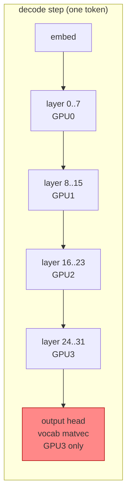

# T6: Decode overlap ceiling (nsys kernel timeline)

Tracks ticket #9. Answers two questions left open by #4 (overlap) and #7 (control):

1. Why did the K=4 decode overlap reach only 1.48x instead of ~4x?
2. Is the host-RAM staging idea from #9 worth pursuing?

## Method

- Model: `Qwen3.5-9B-Q4_K_M.gguf`, dense, 32 layers, 5.68 GB.
- Driver: `-sm layer -ngl all -ts 1,1,1,1 -ctk f16 -ctv f16 -fa off -c 1024`.
- Run: `examples/pipeline/pipeline` with K=4 overlap, n=32.
- Trace: nsys 2024.5.1, exported to SQLite, decode phase bounded by the first and last `mul_mat_vec_q` kernel.

The decode window in the trace is 27.35 s of wall time. All figures below are scoped to that window (prefill excluded).

## Result: per-GPU decode utilisation

| GPU | kernel busy | util | matvec count | matvec avg |
|-----|-------------|------|--------------|------------|
| 0 | 8.66 s | 31.7 % | 8960 | 0.536 ms |
| 1 | 7.63 s | 27.9 % | 7936 | 0.524 ms |
| 2 | 7.63 s | 27.9 % | 7936 | 0.523 ms |
| 3 | 11.63 s | 42.5 % | 7044 | 1.193 ms |

Two things stand out.

**Overlap is happening.** GPUs 0-2 sit at 28-32 % decode util. Strictly serial one-GPU-at-a-time execution would pin every GPU near 25 % of the critical path. Utilisation above that floor is direct evidence of more than one GPU computing at once during decode, which is the stated goal of the fork (#3).

**GPU3 is the straggler.** It runs the fewest matvecs (7044) yet burns the most time (11.63 s), and its matvecs average 1.19 ms - 2.3x the 0.52 ms on the other three. It is the stage the pipeline waits on.

## Root cause: the output head sits on one GPU

The matvec grid sizes give it away:

| GPU | largest matvec gridX |
|-----|----------------------|
| 0-2 | 12288 (layer MLP) |
| 3 | **248320** (vocab scale) |

GPU3 alone carries 132 matvec kernels with `gridX=248320`, each ~31.8 ms, for 4.2 s total - 36 % of GPU3's decode busy time. No other GPU has a matvec above `gridX=12288`. This is the output projection (hidden -> vocab logits), ~20x larger than the biggest layer matvec, and `-sm layer` places it on a single GPU.

The same output projection also shows up as `sgemm_128x128x8_NT_vec` on all four GPUs (132-168 instances, ~15 ms each), so part of it is sharded - but the dominant vocab-scale matvec is not.

The pipeline is only as fast as its slowest stage. GPU3's stage is ~1.5x the mean, so the imbalance alone caps the overlap near 3x, not 4x. The remaining shortfall down to the measured 8.94 tok/s (2.48x) is fill/drain plus per-step sync - 8491 stream-wait events in the window, cumulative 24.1 s, which is the natural upstream dependency rather than wasted work.

## Transfer is not the bottleneck

| copyKind | count | busy |
|----------|-------|------|
| Device-to-Host | 524 | 23.0 ms |
| Host-to-Device | 3275 | 11.9 ms |
| Device-to-Device | 1024 | **2.2 ms** |

Cross-GPU transfer is 2.2 ms over the whole 27 s window. It is not on the critical path. The host-side API trace confirms the CPU spends its time in `pthread_cond_timedwait`/`poll` (the server idle loop), not in copy orchestration.

**Host-RAM staging hypothesis: rejected.** Staging activations through system RAM and driving copies with more CPU threads would move work onto the path that is already provably idle, while adding a second PCIe hop. The decoupling we want already exists via `n_copies` + CUDA events, and it is firing.

## Follow-up: `-ts` rebalancing is flat (corrects the above)

The "compensate in `-ts`" idea was tested and refuted. A 6-point `-ts` sweep on rig1
(`rig1/scripts/sweep_ts.sh`, 3 iterations each, K=4 overlap, same model/flags) is flat:

| `-ts` | avg tok/s | best tok/s |
|-------|-----------|------------|
| `1,1,1,1`  | 8.01 | 8.09 |
| `9,9,9,6`  | 7.85 | 7.89 |
| `9,9,10,5` | 7.90 | 7.92 |
| `9,10,10,4`| 7.94 | 7.96 |
| `10,10,10,3`| 7.94 | 7.98 |
| `10,10,11,2`| 7.98 | 7.99 |

All within noise. The reason is structural, not a bad choice of ratio:

- In `-sm layer`, the output head is a single tensor pinned to the **last** GPU.
  `load_tensors` assigns `pimpl->dev_output = get_layer_buft_list(n_layer_all)` with no
  override; `get_layer_buft_list` maps `il = n_layer_all` to the final device via
  `upper_bound(splits, (n_layer_all)/(n_layer_all+1))`. `-ts` only moves the split *boundaries*
  between intermediate layers - it cannot move or shard the output head.
- The output head is 61x a layer matvec (31.8 ms vs 0.536 ms) and alone makes GPU3 the
  straggler (42.5 % util vs 28-32 % for GPUs 0-2). Giving GPU3 fewer intermediate layers
  removes a small term next to a fixed 31.8 ms, so throughput does not move.

## Conclusion (corrected)

The 1.48x shortfall is **output-head placement**, not a `-ts`-addressable tensor-split
imbalance. In `-sm layer` the vocab projection is a monolithic tensor pinned to the last GPU,
and `-ts` cannot rebalance it. Transfer, kernel-launch, and sync drain are all secondary.

The real lever is sharding the output head across GPUs. That is exactly what
`-sm tensor` does (`output.weight` is configured `GGML_BACKEND_SPLIT_AXIS_1`), but tensor mode
requires flash-attn, which needs tensor cores - unavailable on Maxwell (sm_50), so it is not
viable on rig1. For this model on rig1, ~8 tok/s is close to the practical `-sm layer` decode
ceiling, and no `-ts` value improves it.

## Related

- #4 (overlap), #7 (control) - the 1.48x origin.
- #9 (this ticket), #8 (prefill).
- `docs/experiments/pipeline-parallelism-analysis.md` (mechanism).
