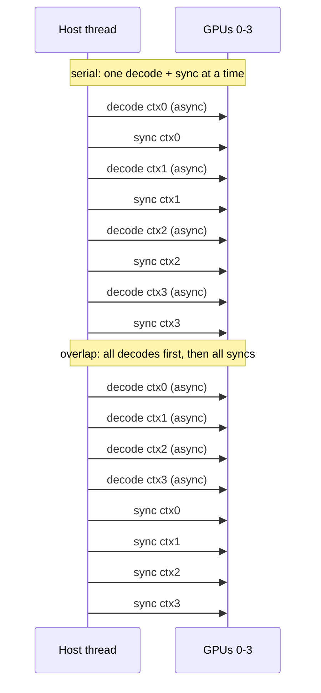

# Pipeline parallelism overlap: parallel-context PoC (Theory A)

Status: complete. Executed on rig1, 2026-09-27.

Tracked by: issue #4 (Theory A). Mechanism and serial baseline: see
`pipeline-parallelism-analysis.md` and `pipeline-parallelism-baseline.md`.

---

## 1. What was measured

The goal: confirm that issuing several `llama_decode` calls back-to-back before a single
`llama_synchronize` lets the upstream `n_copies = 4` + CUDA-events mechanism overlap the
layer pipeline across independent `llama_context`s, lifting aggregate throughput above the
serial baseline.

Method: a minimal driver in `examples/pipeline/` loads a dense model layer-split across the
4 GPUs, creates K independent contexts with the same prompt, and decodes greedily. In
`overlap` mode the K decodes are issued before the K synchronizes; in `serial` mode each
context is decoded and synchronized one at a time (matching the stock server's loop). K in
{1, 2, 4}, 96 predict tokens, 128 prompt tokens.

---

## 2. Model and configuration

- Model: `Qwen3.5-9B-Q4_K_M.gguf` (dense `qwen35`, 5.68 GB, 32 layers).
- Driver: `llama-pipeline -m ... -sm layer -ngl all -ts 1,1,1,1 -ctk f16 -ctv f16 -fa off
  -c 1024 -n 96 --prompt-len 128 -k K`.
- 33/33 layers on GPU, no CPU offload. `pipeline parallelism enabled`, `sched copies = 4`.

The driver reuses `common_init_from_params(..., model_only=true)` then calls
`llama_init_from_model` once per context (`n_seq_max = 1`), so each context decodes exactly
one token per step - there is no batching in the driver. This isolates overlap from the
batching effect seen in #2.

---

## 3. Results

| K | mode | wall (s) | tokens | aggregate tok/s | per-GPU SM (avg) | outputs identical |
|---|---|---|---|---|---|---|
| 1 | overlap | 17.80 | 96 | 5.39 | 22.2 - 33.1% | yes |
| 1 | serial | 17.33 | 96 | 5.54 | 15.4 - 24.7% | yes |
| 2 | overlap | 29.65 | 192 | 6.48 | 20.5 - 33.6% | yes |
| 2 | serial | 34.54 | 192 | 5.56 | 18.9 - 30.7% | yes |
| 4 | overlap | 48.37 | 384 | 7.94 | 9.0 - 53.6% | yes |
| 4 | serial | 71.49 | 384 | 5.37 | 20.0 - 30.8% | yes |

Every run: greedy outputs byte-identical across all K contexts, and identical between
`overlap` and `serial` mode (correctness preserved).

The two modes differ only in how the K decodes are issued:

Each context owns its own CUDA stream, so the K single-token decodes run concurrently on
the GPUs in overlap mode; serial mode drains each one before issuing the next.

---

## 4. Interpretation

Overlap beats serial at the same K, and the margin grows with K:

- K=1: 5.39 vs 5.54 - no gain (a single context has nothing to overlap; the difference is noise).
- K=2: 6.48 vs 5.56 - +16.5%.
- K=4: 7.94 vs 5.37 - +47.9%.

Serial mode stays flat at ~5.4-5.6 tok/s regardless of K (each context decoded one at a time,
so no overlap and no batching). Overlap mode rises 5.39 -> 6.48 -> 7.94 as K grows. Because the
driver issues K separate single-token decodes (no batching), this rise is attributable to
cross-graph pipeline overlap, not to packing more tokens per ubatch.

Against the #2 server baseline at the same concurrency: K=4 overlap = 7.94 tok/s vs the
N=4 baseline of 6.20 tok/s (+28%), and it also exceeds the best server figure of 6.44 tok/s
(N=8) using only half the concurrency.

Per-GPU SM is noisy at the 1-second `dmon` sampling granularity over a ~50 s window that also
includes model load and prefill. At K=4 overlap, GPU3 (the tail of the pipeline) averages
53.6% - above the ~35% serial plateau - consistent with the tail now being kept busy by the
next decode's head, while the earlier GPUs show lower averages. The throughput delta
(overlap vs serial at fixed K) is the cleaner signal than instantaneous SM.

---

## 5. Conclusion

Theory A holds. Multiple independent contexts decoding back-to-back before one sync do
overlap the layer pipeline, raising aggregate throughput above both the serial control and
the #2 server baseline, with greedy outputs unchanged. The driver lives in
`examples/pipeline/` and the sweep harness in `bench/run_pipeline.sh`.
