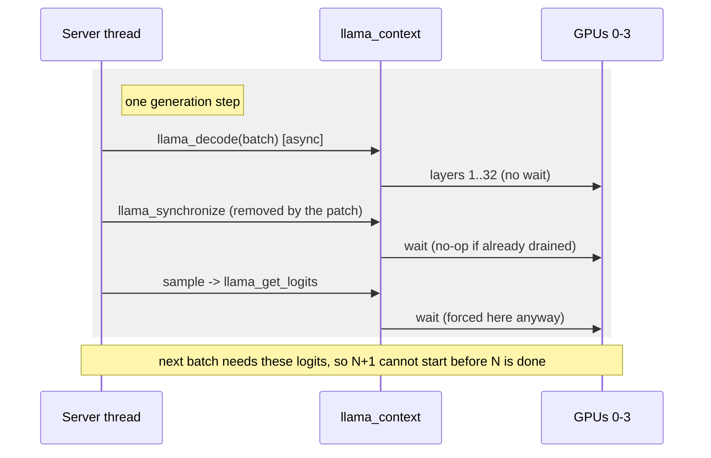

# Pipeline parallelism: deferring the server synchronize (Theory C)

Status: complete (refuted as stated). Executed on rig1, 2026-09-27.

Tracked by: issue #6 (Theory C). Mechanism and serial baseline: see
`pipeline-parallelism-analysis.md` and `pipeline-parallelism-baseline.md`.

---

## 1. What was measured

The goal: confirm whether the stock server serialises because it calls
`llama_synchronize` after every decode that produces output, and whether deferring that sync
to the sampling step unlocks layer-pipeline overlap across slots in the real serving path.

Method: a minimal patch removes the `llama_synchronize` from `server_context::decode`
(`tools/server/server-context.cpp`, the `has_output` branch). The server is rebuilt and run
layer-split across the 4 GPUs, then benchmarked with the same concurrent-completion client
used for the #2 baseline (greedy, no speculative/draft model). Two variants are tested:

1. defer only (remove the explicit sync; sampling still synchronizes).
2. defer + `LLAMA_GRAPH_REUSE_DISABLE=1` (also disable the graph-reuse fast path that
   synchronizes before writing inputs under `pipeline_parallel`).

N in {4, 8}, 64 predict tokens, 128 prompt tokens.

---

## 2. Why the sync cannot be deferred in the serial path

The server already batches all generating slots into one `llama_decode` per update, and it
already syncs once per batch (not per slot). The explicit sync in `decode` is redundant:
`common_sampler_sample` (`common/sampling.cpp`) calls `llama_synchronize` before reading
logits, and the generation path samples every generating slot in `post_decode`.

The deeper point: the next decode's tokens depend on this decode's sampled logits. Sampling
forces a full context synchronize, so decode N must complete before decode N+1 can be issued.
There are no successive decodes to overlap in the serial path - the only overlap the existing
server already gets is during prefill (`has_output == false`, no sampling), which is exactly
the invariant the ticket says to respect.

The synchronise the patch removes is redundant: the sampler synchronises on the next line,
and the next decode's input depends on the sampled logits, so there is no decode N+1 to
issue until N has fully finished.

---

## 3. Results

| config | N=4 tok/s | N=8 tok/s | per-GPU SM (avg, N=8) |
|---|---|---|---|
| baseline (#2, unpatched server) | 6.20 | 6.44 | ~35% flat |
| defer sync only | 5.93 | 5.63 | 30.5 - 34.8% |
| defer sync + graph reuse disabled | 5.88 | 6.63 | 36.1 - 42.9% |

Correctness: every run reported `all_outputs_identical = true`, `n_err = 0`.

---

## 4. Interpretation

Deferring the sync alone does not help: 5.63-5.93 tok/s vs the 6.20-6.44 baseline (the
small deficit is benchmark noise; there is no overlap to gain). Deferring plus disabling
graph reuse gives a marginal +3% at N=8 (6.63 vs 6.44) with SM creeping to ~43% on the tail
GPU, but nothing approaching saturation. That residual gain is the removal of the redundant
graph-reuse synchronize (less sync overhead), not pipeline overlap - the sampling
synchronize still fully serializes decode N before decode N+1.

This is consistent with the code: the only place the server overlaps today is prefill-only
sub-batches, and the only ways to overlap generation are the two other theories - independent
decode streams (Theory A, #4) and speculative/draft decodes (Theory B, #5).

---

## 5. Conclusion

Theory C is refuted as stated. Deferring the server synchronize is a no-op because sampling
synchronizes anyway, and the serial generation path has one decode per sampling point with
nothing to overlap. The patch was reverted; no code change is warranted. To overlap the
server's generation the speculative path (#5) is the vehicle, which is the natural follow-up.
